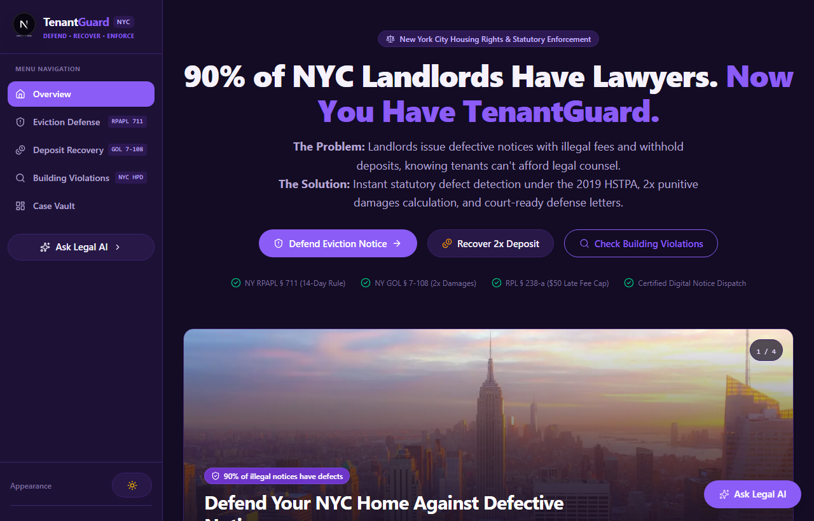
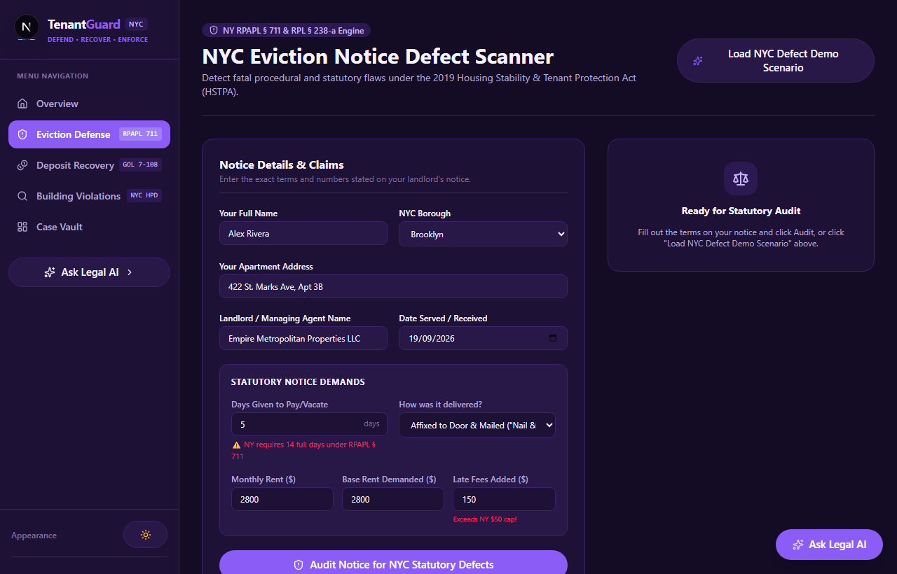
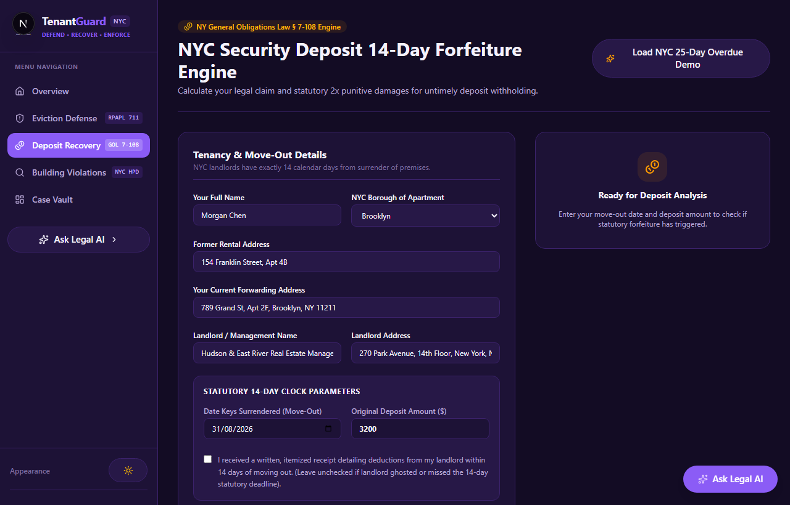
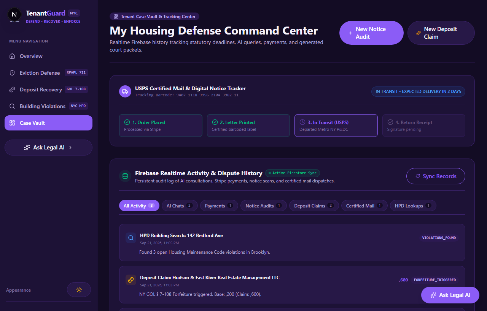
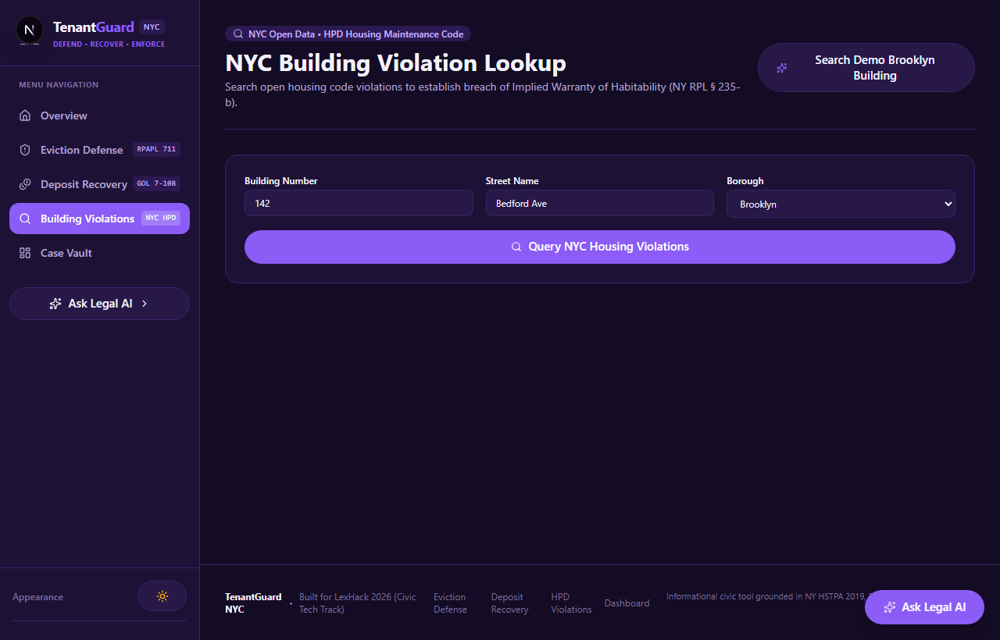
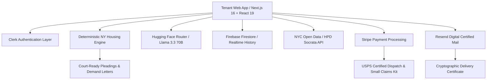

<p align="center">
  
</p>

# 🛡️ TenantGuard NYC
### AI-Powered Tenant Rights, Eviction Defense & Deposit Recovery Platform
**Built for LexHack 2026 • AI, Law & Civic Technology Track**

<p align="center">
  
</p>

[](https://nextjs.org/)
[](https://react.dev/)
[](https://www.typescriptlang.org/)
[](https://clerk.com/)
[](https://firebase.google.com/)
[](https://huggingface.co/)
[](https://stripe.com/)
[](https://resend.com/)

<p align="center">
  <strong>"Over 90% of NYC landlords have attorneys in Housing Court. Fewer than 10% of tenants do."</strong><br>
  <em>TenantGuard levels the playing field with deterministic statutory analysis, court-ready defense pleadings, and open civic data.</em>
</p>

---

</div>

## 📌 Executive Summary & Civic Mission

In New York City, tenants face an acute **"representation gap"** in Housing Court. Landlords routinely issue procedurally defective eviction notices, demand illegal late fees, and unlawfully withhold security deposits because they know self-represented tenants rarely know the specific statutes enacted under the landmark **Housing Stability and Tenant Protection Act of 2019 (HSTPA)**.

**TenantGuard NYC** is a civic technology platform that arms tenants with instant statutory analysis, automated legal document drafting, and official notice delivery:
1. **Eviction Notice Defect Shield**: Spot procedural defects under NY RPAPL § 711 and RPL § 238-a that legally invalidate landlord non-payment proceedings.
2. **Security Deposit 2x Forfeiture Recovery**: Enforce the mandatory 14-day itemization deadline under NY GOL § 7-108 with automatic statutory forfeiture and up to 2x punitive damages calculation.
3. **TenantGuard AI Legal Assistant**: Grounded legal conversational AI powered by **Meta Llama 3.3 70B Instruct** (via Hugging Face Router) providing authoritative, statute-backed answers.
4. **Firebase Realtime Activity Vault**: Complete persistent history tracking AI consultations, Stripe payments, notice scans, and certified mail dispatches.
5. **NYC Open Data (HPD) Inspector**: Real-time lookup of hazardous building code violations directly from the Department of Housing Preservation & Development.

---

## 📸 Real In-App Screenshots

### 1. NYC Eviction Notice Defect Scanner (RPAPL § 711 & RPL § 238-a)
Scans landlord notices for statutory violations including improper cure periods (< 14 days), unlawful late fees (exceeding $50 or 5% under RPL § 238-a), non-rent charges bundled into rent demands, and invalid service methods. Generates a formal **Notice of Statutory Defect & Answer to Defective Rent Demand**.

<p align="center">
  
</p>

### 2. 14-Day Security Deposit 2x Punitive Damages Engine (NY GOL § 7-108)
Under New York law, landlords must provide an itemized statement and deposit return within **14 calendar days** of move-out. Failure to comply results in **complete forfeiture** of the deposit and subjects the landlord to **up to 2x statutory punitive damages** in NYC Small Claims Court.

<p align="center">
  
</p>

### 3. Firebase Activity Vault & Postal Notice Tracking Center
Real-time tracking of dispute cases, USPS certified mail tracking, and persistent Firebase Firestore activity logs across AI consultations, payments, and notices.

<p align="center">
  
</p>

### 4. NYC Open Data (HPD) Housing Maintenance Code Violations Explorer
Direct live query to NYC Department of Housing Preservation & Development API to inspect open hazardous violations (Class A, B, and C emergencies) before landlords retaliate.

<p align="center">
  
</p>

---

## 🏛️ Statutory Precedents Grounded in the App

TenantGuard does not guess or hallucinate legal rights—it operates on precise statutory rules and New York appellate precedents:

| Statute | Legal Rule & Tenant Protection Enforced |
| :--- | :--- |
| **NY RPAPL § 711(2)** | Landlords must serve a **14-day written rent demand** prior to non-payment proceedings. Any notice offering 3, 5, or 10 days is procedurally fatal (*EOM 106-15 217th Corp. v. Severine*). |
| **NY Real Property Law § 238-a** | Late fees are strictly capped at **$50 or 5% of monthly rent**, whichever is less, and cannot be charged before a 5-day grace period. |
| **NY General Obligations Law § 7-108** | Landlords must return the deposit and an itemized receipt within **14 calendar days** of vacating. Missing this window forfeits 100% of retention rights and triggers **up to 2x punitive damages**. |
| **NYC Admin Code § 26-521** | It is a criminal Class A misdemeanor to lock out a tenant, remove doors, or shut off utilities without a formal court warrant executed by an NYC City Marshal. |
| **NYC Housing Maintenance Code** | Landlords must maintain habitability 24/7 (adequate heat from Oct 1–May 31, hot water, mold and lead paint abatement). |

---

## 🛠️ Architecture & Tech Stack



* **Frontend Framework**: Next.js 16.3.5 (App Router, Turbopack, Server Actions)
* **UI & Styling**: Vanilla CSS Token Design System (Dark & Light Mode, Accessible HSL Palettes)
* **Authentication**: Clerk (`@clerk/nextjs`) with modal authentication
* **AI Engine**: Hugging Face Serverless Router (`meta-llama/Llama-3.3-70B-Instruct`)
* **Database & Persistence**: Firebase Firestore (`firebase/firestore`) with local persistent fallback
* **Civic Housing API**: NYC Open Data HPD Housing Maintenance Code Violations (`data.cityofnewyork.us`)
* **Certified Mail & Dispatch**: Resend API with cryptographic transmission audit hashes
* **Monetization Engine**: Stripe API (Checkout Sessions for USPS Certified Mail & Small Claims Kits)

---

## 🚀 Getting Started & Local Development

### Prerequisites
* **Node.js** v18.18.0 or higher (v20+ recommended)
* **npm** or **yarn** or **pnpm**

### 1. Clone the Repository
```bash
git clone https://github.com/Laegend14/tenantguard.git
cd tenantguard
```

### 2. Install Dependencies
```bash
npm install
```

### 3. Configure Environment Variables
Create a `.env.local` file in the root directory:

```env
# Clerk Authentication
NEXT_PUBLIC_CLERK_PUBLISHABLE_KEY=pk_test_...
CLERK_SECRET_KEY=sk_test_...
NEXT_PUBLIC_CLERK_SIGN_IN_URL=/sign-in
NEXT_PUBLIC_CLERK_SIGN_UP_URL=/sign-up
NEXT_PUBLIC_CLERK_SIGN_IN_FALLBACK_REDIRECT_URL=/dashboard
NEXT_PUBLIC_CLERK_SIGN_UP_FALLBACK_REDIRECT_URL=/dashboard
NEXT_PUBLIC_CLERK_AFTER_SIGN_IN_URL=/dashboard
NEXT_PUBLIC_CLERK_AFTER_SIGN_UP_URL=/dashboard

# Hugging Face AI Engine
HF_TOKEN=your_hugging_face_token

# Firebase & Firestore Realtime History
NEXT_PUBLIC_FIREBASE_API_KEY=your_firebase_api_key
NEXT_PUBLIC_FIREBASE_AUTH_DOMAIN=your-project.firebaseapp.com
NEXT_PUBLIC_FIREBASE_PROJECT_ID=your-project-id
NEXT_PUBLIC_FIREBASE_STORAGE_BUCKET=your-project.appspot.com
NEXT_PUBLIC_FIREBASE_MESSAGING_SENDER_ID=your_sender_id
NEXT_PUBLIC_FIREBASE_APP_ID=your_firebase_app_id

# Stripe Payments & Checkout (Test Mode)
NEXT_PUBLIC_STRIPE_PUBLISHABLE_KEY=your_stripe_publishable_key
STRIPE_SECRET_KEY=your_stripe_secret_key

# Resend Certified Legal Mail
RESEND_API_KEY=your_resend_api_key
RESEND_FROM_EMAIL=onboarding@resend.dev
RESEND_TEST_RECIPIENT=tenant@example.com

# NYC Open Data (HPD Housing Violations)
NYC_HPD_APP_TOKEN=...
NYC_HPD_API_KEY_ID=...
NYC_HPD_API_KEY=...
NYC_HPD_SECRET_ID=...
```

### 4. Run the Local Development Server
```bash
npm run dev
```

Open [http://localhost:3000](http://localhost:3000) in your browser.

---

## 🧪 Testing the Live Flows

1. **Eviction Notice Audit**:
   - Navigate to `/eviction-defense`
   - Click **"Load Preset Defective Notice"** to populate real NYC landlord defects (3-day notice, $200 late fee, electronic delivery).
   - Click **"Analyze Notice for Statutory Defects"** to see instant defect identification and preview the court-ready response letter.
2. **Security Deposit Recovery**:
   - Navigate to `/security-deposit`
   - Click **"Load Preset Overdue Deposit"** (22 days elapsed past move-out).
   - Click **"Calculate Statutory Forfeiture & Damages"** to see the 14-day forfeiture trigger, 2x punitive damages calculation, and Small Claims filing packet.
3. **Ask TenantGuard AI**:
   - Click **"Ask Legal AI"** in the sidebar or floating bottom button.
   - Ask any question regarding NYC tenant rights or click a suggested chip.
   - Switch to the **"History"** tab to see your conversations saved in Firebase.
4. **HPD Building Violations**:
   - Navigate to `/hpd-lookup`
   - Enter an address (e.g. `142 Bedford Ave, Brooklyn`) to view live violations.
5. **Firebase Command Center**:
   - Navigate to `/dashboard` to view the **Firebase Realtime Activity Vault** syncing all actions.

---

## 💼 Business & Revenue Model

TenantGuard implements a sustainable **Freemium Self-Help + Premium Automation** revenue model:

| Tier | Price | Features Included |
| :--- | :--- | :--- |
| **Free Civic Tier** | **$0.00** | Statutory defect scanner, 14-day deposit calculator, HPD violations search, basic notice generation. |
| **Digital Certified Dispatch** | **$4.99** | Instant digital certified delivery via Resend with cryptographic delivery certificate and timestamp hash for court admissibility. |
| **USPS Certified Mail Service** | **$14.99** | Automated physical printing, folding, postage, and USPS Certified Mail dispatch with tracking barcode and Return Receipt Electronic (RRE). |
| **Small Claims Court Pro Kit** | **$29.00** | Complete court-ready filing packet: summons template, statement of claim, evidence checklist, statutory citation brief, and hearing day script. |

---

## 📄 License & Legal Disclaimer

TenantGuard is licensed under the [MIT License](LICENSE).

> **Disclaimer**: TenantGuard NYC is an AI-powered civic technology and self-help information platform grounded in New York housing statutes. It does not constitute formal legal representation or create an attorney-client relationship. If you are facing an active court proceeding or warrant of eviction, consult NYC 311, Legal Aid Society, or the Legal Services NYC tenant helpline immediately.
